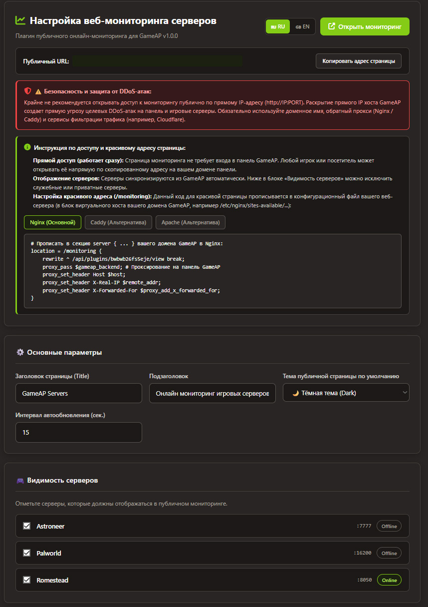

# 🎮 GameAP WebMonitoring Plugin

<p align="center">
  
</p>

<p align="center">
  <strong>Public WebAssembly (WASM) game server monitoring plugin for the <a href="https://gameap.ru/">GameAP</a> management panel.</strong>
</p>

<p align="center">
  <a href="https://github.com/br1ckzzz/gameap_monitoring_plugin/releases"></a>
  <a href="LICENSE"></a>
  <a href="https://go.dev"></a>
  <a href="https://webassembly.org"></a>
</p>

<p align="center">
  <a href="README.ru.md">🇷🇺 Читать документацию на русском языке</a>
</p>

<p align="center">
  
</p>

---

## 📌 Overview

**GameAP WebMonitoring** adds a standalone, high-performance public monitoring page to your GameAP installation. It allows players and community members to track server statuses in real time without requiring an account or credentials in GameAP.

The plugin compiles into a single WebAssembly module (`web_monitoring.wasm`, target `wasip1`) and executes within GameAP's sandboxed **Wazero** runtime. It runs entirely inside GameAP, requiring no background daemons, external services, or complex runtime dependencies on the host.

---

## ✨ Features

- 🛡️ **Zero-Dependency WebAssembly Sandbox:** Compiles to a single `.wasm` binary that runs securely within GameAP Wazero runtime.
- 🌐 **Instant Public Access:** Both the web view and JSON API are accessible to visitors out of the box with zero exposure of sensitive data (RCON passwords, tokens, and internal paths remain protected).
- 🎨 **Modern Responsive UI:**
  - Dark and Light themes with instant toggle and persistent user preference.
  - Multi-language support (**English** and **Russian**) for both visitor page and admin control panel.
  - Live server status badges (Online / Offline).
  - Game filters (Counter-Strike 2, CS 1.6, Minecraft, Rust, Team Fortress 2, and others).
  - Real-time search by server name, game, or IP address.
  - 1-click IP address copying and `steam://connect` direct launch links.
- ⏱️ **Live Countdown & Auto-Refresh:** Periodic status refresh with countdown timer and manual reload button.
- ⚙️ **GameAP Admin Panel Integration:**
  - Server visibility toggles to hide private or maintenance servers.
  - Customizable title, subtitle, default theme, and refresh intervals.
  - In-browser Custom CSS and Custom Header HTML editors (embed Discord/Telegram widgets, banners, or logos without recompiling).

---

## 📂 Repository Structure

```
gameap_monitoring_plugin/
├── .github/                # CI/CD Workflows (automatic builds and GitHub releases)
│   ├── workflows/ci.yml
│   └── workflows/release.yml
├── frontend/               # UI source files
│   ├── index.html          # Public monitoring page layout
│   ├── styles.css          # Modern responsive styling
│   ├── app.js              # Client-side state, filtering, and auto-refresh
│   └── admin_bundle.js     # GameAP Admin Panel Vue 3 component bundle
├── plugin/                 # Go source code (WebAssembly/WASI)
│   ├── main.go             # Plugin registration via GameAP SDK
│   ├── handler.go          # HTTP routing and asset delivery
│   ├── monitor.go          # Safe server status retrieval
│   ├── settings.go         # Settings persistence and serialization
│   └── assets/             # Bundled web assets compiled into the binary
├── scripts/                # Build scripts
│   ├── build.sh            # Linux / macOS build script
│   └── build.ps1           # Windows PowerShell build script
├── Dockerfile              # Containerized multi-stage build
└── mock_server.py          # Standalone local dev preview server
```

---

## 🚀 Installation

### 1. Download or Build the Plugin Binary

Download `web_monitoring.wasm` (v1.0.1) from the latest **[GitHub Releases](https://github.com/br1ckzzz/gameap_monitoring_plugin/releases)** (or build it from source as described below).
Copy `web_monitoring.wasm` into your GameAP plugins directory (default: `/var/lib/gameap/plugins/` or your configured `PLUGINS_DIR`).

### 2. Activate in GameAP

1. Sign in to your GameAP panel as Administrator.
2. Navigate to **Administration -> Plugins**.
3. Locate **GameAP WebMonitoring** and enable it (or run `gameapctl plugins reload`).
4. A new **Monitoring** navigation entry will appear in your panel sidebar.

---

## ⚠️ Critical Security Notice: Reverse Proxy & DDoS Protection

> [!CAUTION]
> **DO NOT expose the public monitoring page via raw server IP (e.g. `http://YOUR_SERVER_IP:8080/api/...`)!**
> Revealing your host server's real IP address directly to the public makes your machine an easy target for **DDoS attacks** (Direct-to-IP / volumetric floods). A DDoS attack on the web port can easily exhaust system resources and knock offline both your GameAP management panel and all game servers hosted on the same machine.

### Best Practices for Secure Public Exposure:
1. **Always use a Domain Name (FQDN):** Never give players direct IP access to the web panel.
2. **Reverse Proxy (Nginx, Caddy, Apache):** Terminate SSL, handle rate limiting, and route requests safely to GameAP.
3. **DDoS Mitigation Layer (Cloudflare, DDoS-Guard, etc.):** Put your domain behind a proxying CDN such as **Cloudflare** (with proxying enabled 🟠) to conceal your origin server IP address completely.

---

## 🌐 Public URL & Web Server Configuration

### Out of the Box Access

The monitoring page is accessible on your domain:

```
https://<your-gameap-domain>/api/plugins/monitoring/view
```

- Fully public and requires no login or panel permissions.
- Works automatically with HTTPS and existing domain configurations.

### Clean Short URL (`/monitoring`)

To give players a clean short URL (e.g. `https://<your-domain>/monitoring`), configure a rewrite rule in your web server.

#### 1. Nginx (Recommended)

Add this inside your existing GameAP `server { ... }` block (e.g. in `/etc/nginx/sites-available/gameap`):

```nginx
location = /monitoring {
    rewrite ^ /api/plugins/monitoring/view break;
    proxy_pass $gameap_backend; # Or http://127.0.0.1:8080
    proxy_set_header Host $host;
    proxy_set_header X-Real-IP $remote_addr;
    proxy_set_header X-Forwarded-For $proxy_add_x_forwarded_for;
}
```

#### 2. Caddy (Modern Alternative with Automatic HTTPS)

Add this inside your domain block in your `Caddyfile`:

```caddy
handle /monitoring {
    rewrite * /api/plugins/monitoring/view
    reverse_proxy localhost:8080
}
```

#### 3. Apache (Alternative)

Add this inside your `<VirtualHost *:443>` block or `.htaccess`:

```apache
RewriteEngine On
RewriteRule "^monitoring$" "/api/plugins/monitoring/view" [PT]
```

> **Note:** Static assets (`/plugins/web-monitoring/`) and API routes (`/api/plugins/monitoring/`) are handled automatically by GameAP.

---

## 🛠️ Building from Source

Requirements: **Go 1.22+** or **Docker**.

### Using Build Scripts

#### Linux / macOS

```bash
chmod +x scripts/build.sh
./scripts/build.sh
```

#### Windows (PowerShell)

```powershell
powershell -ExecutionPolicy Bypass -File .\scripts\build.ps1
```

### Using Docker (No Go installation needed)

```bash
docker build -t gameap-web-monitoring -f Dockerfile .
docker create --name temp-build gameap-web-monitoring
docker cp temp-build:/web_monitoring.wasm ./web_monitoring.wasm
docker rm temp-build
```

---

## 🧪 Local Preview & Development

You can preview and test the frontend interface locally without running a full GameAP instance:

```bash
python mock_server.py
```

Open **<http://localhost:8050>** in your browser to inspect the UI with mock server data.

---

## 🔄 Automated CI/CD Publishing (plugins.gameap.dev)

This repository includes a GitHub Actions Workflow (`.github/workflows/release.yml`) that automatically compiles the WebAssembly binary and can publish new releases directly to the official GameAP plugin catalog at [plugins.gameap.dev](https://plugins.gameap.dev).

### GitHub Secrets Configuration:
1. Log in to your developer profile at **[plugins.gameap.dev](https://plugins.gameap.dev)** and generate an API Deploy Token.
2. In your GitHub repository, navigate to **Settings** -> **Secrets and variables** -> **Actions**:
   - **Repository secrets**: add `GAMEAP_DEPLOY_TOKEN` with your generated token.
   - *(Optional)* `GPG_SIGNING_KEY` — your ASCII-armored private GPG key to sign `web_monitoring.wasm.asc`.
   - **Repository variables**: `GAMEAP_PLUGIN_ID` (defaults to `monitoring` if omitted).

---

## 📄 License

Distributed under the MIT License. See [LICENSE](LICENSE) for details.
